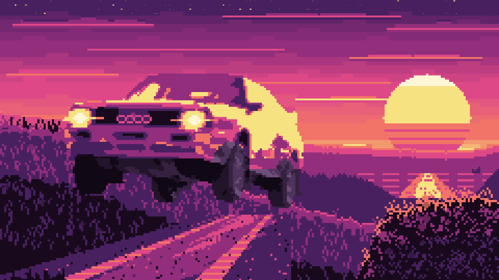

# acidtrip

A terminal ANSI art editor in the spirit of **ACiDDraw**, rebuilt for today: mouse-first, rebindable keys, every classic scene format, modern exports (SVG, HTML, React, GIF), TheDraw/FIGlet lettering, stencils, versions and crash recovery, and Claude as a drawing partner.

```sh
curl -fsSL https://raw.githubusercontent.com/jondot/acidtrip/main/install.sh | sh
acidtrip                 # new canvas
acidtrip logo.ans        # open (or create) a file
```

The installer picks the binary for your platform (macOS and Linux, x86_64 and arm64) from [Releases](https://github.com/jondot/acidtrip/releases) and puts it in `/usr/local/bin`, or `~/.local/bin`. To build from source: `cargo install --git https://github.com/jondot/acidtrip acidtrip`.

A terminal that supports truecolor and mouse input is enough: iTerm2, kitty, WezTerm, Ghostty, Alacritty, or Terminal.app with fewer key combinations. Colors are always drawn from the document's own VGA palette, so the art looks the same whatever terminal theme you use.

## Drawing

Drag with the mouse to paint. **`E` toggles the eraser**: press it, erase, press it again to go back. Picking a tile also returns you to the brush. Right-drag, Option-drag or Ctrl-drag also erase, in terminals that pass them through. iTerm2 may use right-click for its own menu.

From the keyboard it works like ACiDDraw: the arrows move, and the number row types tiles from the active set, advancing like typing. The set is shown top-right as `1░ 2▒ 3▓ 4█ …`. Shift+arrows draw a trail with the current tile. Space applies the current tool, and for shapes a second Space finishes the shape.

| Key | Tool | | Key | Tool |
|---|---|---|---|---|
| `B` | brush | | `G` | fill bucket |
| `T` | type text (Esc returns) | | `I` | eyedropper |
| `P` | smart pen with brushes (`Shift-P` brush studio) | | `F` | TheDraw / FIGlet text stamp |
| `H` | half-block pixels (two colors per cell) | | `D` | gradient fill |
| `W` | pattern brush (`Shift-W` selection as pattern) | | | |
| `L` `R` `O` | line, rectangle, ellipse | | `N` | stencils |
| `S` `C` `E` | shade ░▒▓█, colorize, erase | | `V` | select |
| `Tab` | cycle the tool's option | | `Shift-Tab` | shape look █┌╔╒╓╭ |
| `M` | mirror / symmetry | | `Z` | zoom |
| `Shift-F` | photo filters | | `Shift-C` | recolor (replace a color) |

- **The sidebar** is a stack of panels, one per topic: tools, the active tool's options, colors, characters, layers and the map. Every option shows all its choices as chips you click (paint mode, fill match, outline/filled, the shape's look, stamp mode, mirror, shade direction, insert/overwrite), so nothing hides behind a key. The pen's panel has the brush with ‹ › arrows, a live preview stroke, a size slider and a ⚙ for the studio. Hover over anything and the status bar says what it does and its key.
- **The status bar** is clickable too. The canvas size (`80x25`) opens *Canvas size*, which has presets, *fit art* and a preview that shows in red any art a smaller size would cut off. The art stays at the top-left. The mode (`CLASSIC`/`MODERN`) and `iCE` toggle when clicked, and Ctrl-Z undoes any of them.
- **Colors (like Paint):** the sidebar has an FG box and a BG box. Click a box to make it active, then click a palette color to set it; everything works with one mouse button. Right-click sets the other box, where the terminal passes it through. `X` swaps them, `,` `.` `;` `'` step through the colors, clicking the active box opens the full color dialog, and `Alt-Z` toggles iCE colors (16 backgrounds).
- **Characters (the ACiDDraw bar):** `1`–`0` place the active set's glyph at the cursor and move right. With the mouse, a key puts the glyph where the pointer is. Clicking a glyph in the sidebar makes it the brush, and a ghost shows under the pointer before you paint. `[` `]` switch between the 15 sets, and `Alt-K` opens the full CP437 (or Unicode) picker.
- **The Art tool** (`Ctrl-G`, or ▚ in the tools grid) turns the keyboard into a glyph board, so the left hand types blocks and the right hand moves. It has its own panel in the sidebar, and picking any other tool leaves it.
  - **Spatial keys:** `Q W E` / `A S D` / `Z X C` are the nine parts of a cell, each key's glyph sitting where the key sits (`W` ▀, `S` █, `X` ▄, `A` ▌, `D` ▐). `T G B` and `F V` hold the details that go with the set.
  - **Glyph sets:** `[` `]` (or ‹ › on the panel) rotate the board through Blocks, Single lines, Double lines, the two Mixed line sets (╓ and ╒), and, in Modern documents, Quads and Eighths. The sets come from counting glyphs across 500+ scene files from 1994–2023. Classic documents keep to CP437, so corner keys type CP437 textures instead of quadrants.
  - **Shades:** `1`–`5` are always ░▒▓█■.
  - **Erasing:** `R` (or Space) erases the cell. Typing a glyph onto the same glyph erases it too.
  - **Right hand:** `I J K L` move and `Shift` draws a trail. `Y` undoes and `H` redoes. `U`/`O` cycle the foreground and `M`/`,` the background.
  - **The board:** the panel shows the keyboard with each key's glyph in your colors. Click a key to give it another glyph; that's saved per set. The mouse paints with the last glyph typed. `Esc` or `Ctrl-G` leaves the tool.
- **Gradient fill** (`D`, or ▒ in the tools grid) drags a color ramp over an area: the selection if there is one, otherwise the area the bucket would fill from where you start. The canvas shows the result while you drag, and letting go is one undo step. A click without a drag runs top to bottom. It has its own panel in the sidebar:
  - **Shape:** *linear* runs along the drag, *radial* rings out from where it starts. ⇄ (or a right-drag) runs the ramp the other way.
  - **Style:** ░▒▓ *shades* puts solid colors with ░▒▓ mixes between them, in even bands, the way scene artists shade by hand. ▀▄ *half blocks* uses two colors per cell, for twice the steps up and down. *Smooth* is truecolor per cell (Modern only). *Dither* is the shade ladder with an ordered pattern across each step.
  - **Ramps:** your foreground to background, fire, ice, sunset, gray and rainbow. The strip under them shows the ramp as this document will get it. In Classic documents every stop is matched to the nearest of the 16 colors, and colors lying on the way are added as steps, so black to white goes through both grays. Without iCE, backgrounds stay in the dark 8.
- **Minimap and layers:** the sidebar minimap shows the whole piece with your view highlighted. Click or drag it to jump, and `Alt-M` toggles it. Each layer shows a thumbnail, with buttons to add, duplicate, delete, move and merge. `Ctrl-L` opens the full Layers panel for show/hide, lock, reference and rename.
- **Importing images:** *File → Import image…* turns a PNG, JPEG, GIF, WebP or BMP into art. Pick it from the list (images here, plus Downloads, Desktop and Pictures, newest first), type a path, or drop the file on the window. Presets set everything at once: *photo*, *scene* (16 colors, ░▒▓ dithering, CP437 only), *pixel art* (kept sharp), *cel* (anime and flat-colored drawings: outlines stay dark, fills stay flat), *comic* (ink drawings and comics: bolder lines), *line art* and *ascii*. The dialog looks at the picture and picks one ("looks like cel"); keys `1`–`7` switch. *Keep lines* finds thin dark strokes before the image is shrunk and carries them into the glyphs, so outlines survive at 80 columns instead of fading into the fill. Each setting is a `‹ value ›` row you click or change with `←` `→`, and the preview updates as you go. A *Photo filter* row runs any of the Filters presets on the picture before it is converted. Every cell tries each block glyph and picks the shape and two colors that match best; Modern documents also get quadrants, sextants and eighths in truecolor. Classic documents can use their own 16 colors, 16 fitted to the image (for a new document), or switch to truecolor. The result goes into a new layer, a new document, or a floating stamp you place.
- **Filters** (`Shift-F`, or ◐ in the tools grid) are the iPhone and Instagram looks for your art. The panel has ‹ › to step through 43 presets: Original, the iPhone set (Vivid, Dramatic and their warm and cool versions, Mono, Silvertone, Noir, and the iOS 7 Chrome, Fade, Instant, Process, Transfer and Tonal) and 27 classic Instagram filters from Clarendon to Ludwig, modelled on CSSgram's recipes. Under them are 13 sliders that stack on the preset: exposure, brightness, contrast, highlights, shadows, saturation, vibrance, warmth, tint, hue, fade, vignette and strength. The filter works on the selection, else the layer, and changes both the glyph and the background color of every cell; the vignette darkens toward the edges. The canvas previews it live, holding the mouse down on the canvas shows the original, and *apply* (or `Enter`) is one undo step. Classic documents map the result to the nearest of their 16 colors; *re-render* re-fits the glyphs through the image importer instead, so blocks mix the 16 colors into smoother tones.
- **Recolor** (`Shift-C`, or ◈) replaces one color with another. Click a cell on the canvas to pick the color to replace, or click one of the chips that list the piece's colors with how many cells use each. The new color is the brush FG. Chips choose foreground, background or both, this layer or all layers (inside the selection when there is one), and a *tolerance* slider catches similar truecolor shades. The canvas previews it live and *apply* (or `Enter`) is one undo step.
- **Blocks:** select with `V`, then `Enter` opens the ACiDDraw-style block menu: copy, move, fill, outline, flip (with glyph mirroring), rotate, justify, delete-shift, crop, save as stencil, use as pattern, or ask the AI.
- **Editing:** `Ctrl-C` `Ctrl-X` `Ctrl-V` copy, cut and paste; pasted blocks follow the mouse and stamp on every click. `Ctrl-Z` and `Ctrl-Y` undo and redo, with unlimited history. `Alt-I` and `Alt-Y` insert and delete a line, and `Alt-Shift-I` and `Alt-Shift-Y` do the same for a column.
- **Anything else:** `Ctrl-K` opens a command palette that fuzzy-searches every command. `?` shows the live key sheet.

**Keymaps.** The `modern` preset is the default and `acid` gives ACiDDraw's Alt-letter keys. Override any key in the config file; `acidtrip keys` lists every action id.

```toml
[keymap]
preset = "modern"
[keymap.bindings]
save = ["ctrl-s", "f2"]
```

**The smart pen** draws your stroke at the glyph's own 8×16-pixel resolution, then picks, for each cell, the glyph from the active set whose real bitmap best matches what the stroke covered: `▀ ▄ ▌ ▐` for clean edges, `░ ▒ ▓` to smooth slopes, and connected `─ │ ┌ ┘` with a box-drawing set. With terminals that report exact mouse pixels (kitty, WezTerm, Ghostty, xterm, and others) it follows the pointer inside the cell.

**Brushes** make the pen a paint program. `Tab` cycles the presets, `-` and `=` resize, and `Shift-P` (or the ⚙ in the pen's sidebar panel) opens the brush studio with sliders and a live preview stroke:

| Brush | What it does |
|---|---|
| Ink | the crisp smart pen |
| Brush pen | tapers at both ends, thins when you move fast |
| Marker | bold square tip, blocks |
| Calligraphy | 45° flat nib: thick one way, thin the other |
| Airbrush | soft edge, builds up `░ ▒ ▓ █` where you go over it |
| Soft shade | 60% tone that never goes solid, for shading |
| Chalk | paper grain breaks the ink up |
| Spray | scattered dots `· ∙ • °` |
| ASCII | text-art characters `_ ^ * / \ o` |
| Line art | connected single box lines |

Each brush is a tip (size, hardness, roundness, angle, square), ink (opacity, flow, spacing, scatter, count, grain), the hand (taper, speed thinning, streamline stabilizer) and a glyph set (tile set, blocks, shades, ASCII, dots, lines). `S` in the studio saves your tweaks as a preset in the library's `brushes/` folder, one small TOML file each; a preset saved under a built-in's name replaces it. The AI paints with the same brushes (`brush_stroke`).

**The pattern brush** (`W`, or ▦ in the tools grid) paints with a small tile that repeats. Its sidebar panel shows the pattern tiled, with ‹ › to step through them (`Tab` / `Shift-Tab` do the same). Click the name or the preview to browse every pattern as a swatch.

- **Three ways to paint:** *brush* paints strokes (`-` and `=` or the panel's − + set the width), *rect* fills a dragged rectangle, and *fill* floods a region like the bucket. Right-drag erases the same cells.
- **Seamless:** tiles line up on the canvas grid, so separate strokes, rectangles and fills join with no seams. *align start* instead starts a fresh tile where you press.
- **Holes:** empty cells in a pattern are transparent, so bricks, grids and dots leave the art underneath alone.
- **Built-ins:** classic scene textures such as bricks, a box-line wall, checkers, basket weave, twill, scales, waves, shade bands, a dither ramp, single and double grids, honeycomb, argyle, polka dots, a starfield and card suits. They paint in the brush colors. Classic documents list only the ones drawn in CP437.
- **Your own:** select some art and press `Shift-W`, *use selection* on the panel, or `P` in the block menu. The selection becomes the pattern, colors and all (*colors: brush* recolors it). *★ save* keeps it in the library's `patterns/` folder, one small JSON file each. Delete saved ones from the browser.

**Shapes follow the tile you picked:** a solid block draws lines, rectangles and ellipses at half-block resolution, so circles come out smooth. A box-drawing character draws the matching frame. Anything else is drawn with that glyph.

**Documents** come in two kinds:

- **Classic:** CP437 characters and 16 colors, saved losslessly to `.ans`, `.xb` and `.bin`.
- **Modern:** any Unicode character and 24-bit color, for SVG, HTML, React and UTF-8 output.

Documents also support layers, including reference layers: imported images shown dimmed for tracing and never exported. Widths are arbitrary (80, 160 or anything else), and SAUCE metadata is editable with `Alt-D`.

## Formats

| | Load | Save |
|---|---|---|
| ANSI `.ans` (iCE, 24-bit PabloDraw), UTF-8 ANSI | ✓ | ✓ |
| BIN, XBin, Artworx ADF, iCE Draw IDF, TundraDraw TND | ✓ | ✓ |
| PCBoard, Avatar, ASCII | ✓ | ✓ |
| `.acid` (native: layers + metadata + edit history) | ✓ | ✓ |
| PNG (imported as art; pixel-exact VGA render on export) | ✓ | ✓ |
| GIF (still, BBS "modem reveal", layers as frames), SVG (text or pixel-exact) | | ✓ |
| HTML page, React `.tsx` component, C/Pascal/ASM arrays, mIRC, asciinema cast | | ✓ |

Saving keeps the whole canvas, blank rows at the bottom included, so a piece reopens at its own size. `.ans` files shorter than 25 rows get a SAUCE record that says how tall they are.

```
acidtrip convert art.ans art.svg --pixel-exact
acidtrip convert art.ans art.gif --gif reveal --baud 9600
acidtrip render art.xb art.png --scale 2
```

## Export panel

`Ctrl-E` opens the EXPORT panel in the sidebar, like Figma's export section. Set up the files once and they are written with one click.

- **What:** a thumbnail of the whole piece, or of the selection if there is one. The *whole* / *selection* chips switch between them.
- **Rows:** one per file. Each row has a scale chip (`1x`, `2x` … for PNG and GIF; right-click steps back), a file name and a format chip. `+ add export` adds a row and `−` removes one.
- **Row editor:** click a name or format to open it. Names are patterns: `{name}`, `{name}@2x`, `{name}-{frame}` (one file per frame), plus `{w}` and `{h}`. The editor also has every format and that format's options.
- **Folder:** next to the file unless you click it and pick another.
- **↓ Export:** writes every row, replacing old files, and lists what it wrote. `Alt-Shift-E` does the same from anywhere.

The rows and folder are saved with the piece in `.acid` files. Formats with no room for them (`.ans`, `.xb` and the other art files) keep them in acidtrip's data folder, by file, so they come back when you reopen it. An untitled piece has nowhere to export to yet: Export opens *Save as…* first and the files go next to it. *Export as…* (the panel's `as…`, or the palette) is still there for a single file.

## Sharing

`Alt-E` (or `Ctrl-Shift-E`) opens the share menu:

1. copy the art as a PNG image, ready to paste into chat
2. copy it as ANSI text for terminals and code blocks
3. copy it as plain text
4. publish a GitHub gist (needs `gh`)
5. upload the PNG to a paste host and copy the link
6. export it to any format

## Draw together

`Alt-T`, the `⇄` chip in the status bar, or palette › *Draw together* opens the TOGETHER panel. Two or more people then draw on one canvas, BBS art jam style.

- **Host this drawing:** you get a *ticket*, a short string that is copied to the clipboard. Send it to the others any way you like. *Copy* copies it again.
- **Join:** paste the ticket, anywhere in acidtrip or into the *join›* field (a click on the field pastes it), then press *Join*. You get the host's drawing as it is now, and every edit from then on.
- **Who's here:** the panel lists everyone in their own color, and their cursors show on the canvas with their names. Your name is your login name; set `ui.name` in the config to change it.
- **Undo** takes back only your own edits, and only the cells nobody has drawn over since.
- **Leave** (or *End session* when you host) stops sharing. Your copy of the drawing stays. When the host ends the session, everyone is told.
- **Networking:** peer to peer over [iroh](https://iroh.computer). Peers dial each other by key, not IP; connections punch through NATs and fall back to n0's public relays when a firewall blocks them. mDNS finds peers on a LAN with no internet. There are no accounts and no servers to run. A dropped connection reconnects by itself.

## Replay

Watch a piece being drawn again, speed-paint style. Click **► replay** in the sidebar's TOOLS header, or press `Shift-R` (`Alt-Shift-R` from anywhere).

- The replay panel takes the tool options' place. It has play/pause, a scrubber you can click or drag, and speed chips: `1×`, `4×`, `16×`, or `30s` to fit the whole piece into half a minute.
- **skip idle** cuts long pauses down to a second. **hide undone** plays only the work that survived.
- `Space` plays and pauses, and so does a click on the canvas. `← →` step, `Home`/`End` jump to either end, and `Esc` goes back to drawing.
- Replay never touches the piece: leaving shows the live document again, and any edit leaves replay first.
- **↓ GIF** and **↓ .cast** save the replay next to the file as an animated GIF or an asciinema recording. An untitled piece is saved first: *Save as…* asks where.

Every edit, undo and redo is logged with its time and saved zstd-compressed inside `.acid` files, so the history travels with the piece. Recovery snapshots keep it too, so a piece restored after a crash still replays. Other formats and versions don't keep it. A piece without history plays the modem reveal instead.

```
acidtrip replay art.acid art.gif              # fit into 30 s
acidtrip replay art.acid art.cast --speed 4 --hide-undone
```

## Animation

A piece can have frames. Click **▸ frames** in the LAYERS header (or press `Alt-F` to add a frame straight away) and the FRAMES panel opens above the layers.

- **Filmstrip:** a thumbnail per frame, the one you draw on lit. Click a thumbnail to go to it, or use `‹ ›`, `<` `>` (tool mode) or `Alt-←` `Alt-→` from anywhere.
- **+ ⧉ ◀ ▶ ✕** add a blank frame, duplicate this one, move it earlier or later, and delete it. `Alt-F` adds and `Alt-Shift-F` duplicates.
- **Onion skin:** the previous frame shows dimmed wherever this one is empty, so you can trace the next pose. The next frame can show through too. Both are toggles in the panel.
- **Timing:** `fps` sets the speed (8 by default) and `hold` keeps a frame on screen for more ticks.
- **▶ play** (`Alt-Shift-P`) loops the animation on the canvas; drawing or picking a frame stops it.
- Each frame has its own layers. Every frame operation is one undo step, and undo takes you to the frame it changes. Replay, Draw together and `.acid` files keep the frames; a piece with one frame is saved exactly as before.

Exports play the frames with their timing: an animated **GIF**, an **ANSI animation** (each frame redrawn from the top-left, the classic ansimation; `cat` it at a baud rate), and an asciinema **.cast**. Save / Export has an *All frames* switch for ANSI and .cast; turn it off to write just the frame you are on. acidtrip opens ANSI animations back up as frames. On the command line a GIF of an animated piece is animated unless you ask for `--gif still`:

```
acidtrip convert walk.acid walk.gif
acidtrip convert walk.acid walk.ans            # plays with cat
acidtrip convert walk.ans walk.cast
```

## Never lose work

- **Undo:** every edit is undoable. A brush stroke is one step, and an AI run is one step.
- **Recovery:** unsaved documents are autosaved every 20 seconds, edit history included. After a crash, the next start offers to restore them.
- **Versions:** a version is saved on every save and every 5 minutes of editing. `Alt-V` browses them with a live preview; restore one, or open it in a new tab.
- **Backups:** saving over a file keeps a `.bak` copy, or numbered `.001`–`.999` copies like ACiDDraw.

## AI

- **Prompt bar** (`A` or `Ctrl-/`): ask for "make a logo that says NEON", "colorize the selection with a fire gradient" and the like.
  - Claude draws on its own **AI layer** with real tools (boxes, half-block pixels, TheDraw fonts, stencils). It looks at a render of its work before it finishes.
  - One `Ctrl-Z` undoes the whole run, and `Esc` cancels it.
  - Needs `ANTHROPIC_API_KEY`, or `ai.api_key` in the config.
- **Claude Code / MCP:** register once and Claude Code draws straight into your open editor, live and undoable. No API key is needed in acidtrip:
  ```
  claude mcp add acidtrip -- acidtrip mcp
  ```
  With no editor running, `acidtrip mcp` works on a headless canvas and can save files.

## Gallery

`Ctrl-F` (or palette › *Gallery*) browses scene art like a streaming service: rows of posters, arrows or the mouse to move, `Enter` to open.

- **Home rows:** what you opened recently, your collection, your local folders (`+` adds one), famous groups, then every year on 16colo.rs, newest first.
- **Posters:** real pixel renders on terminals with graphics (iTerm2, kitty, sixel), half-block previews elsewhere. They load in the background, what's on screen first.
- **Grids:** a pack, a group, an artist or a folder opens as a grid. `/` searches packs, groups and artists on 16colo.rs, plus your own pieces.
- **A piece opens full screen** with its credits and SAUCE. Scroll it, or play it at 14400 baud (`p`). From there:
  - `Enter` opens it as an untitled document to remix; the credits stay in SAUCE.
  - `s` sends it (or a whole pack) to the sourcing studio.
  - `c` saves a copy to your collection, which works offline.
  - `t` takes a part of it: drag a box over the part you want and it becomes a floating paste in your art, with its colors fitted to your document.
- **Gallery | Studio:** the Gallery and the sourcing studio are two tabs of one window. Click a tab on its top border or press `Ctrl-T`; `s` on a piece opens the Studio tab on it.
- **The GALLERY panel** in the sidebar keeps the pieces you've viewed full screen, as a strip of small pictures (cached, so it works offline). Click one to select it and again to view it; `‹ ›` scroll. *✂ take* opens it to take a part, and *gallery* / *studio* open the window on either tab.

## Fonts & stencils

- **Fonts:** the FIGlet standard font set is built in. `acidtrip fonts get` (or palette › *Download more TheDraw fonts*) installs about 1,200 TheDraw font files, around 3,700 fonts, from the tdfiglet collection.
- **Stencils:** save any selection as a stencil. Stencils are searchable by name, tags and author, and stamp as a transparent, opaque or under layer.

**The sourcing studio** (the Gallery's *Studio* tab, the sidebar's *studio* button, or palette › *Harvest fonts & stencils from art*) builds fonts and stencils from scene art, by hand or with Claude. Every step is a button in the bar at the bottom, with its key on it.

1. **Find art:** the 16colo.rs browser fills itself (years, then packs). You can also type a URL, a zip, a file or a folder. Sources you've loaded come back as one-click chips.
2. **Pick a logo:** the logos found in the source, with the artist's credit. The side panel shows which of your fonts the letters would go into and what that font has so far. A single file (or a piece sent from the Gallery) skips this and opens straight in the cutter; `Esc` there comes back here.
3. **Cut letters:** the whole piece, free form. Select a letter any way you like — **lasso** (`l`, draw around it; a click takes the shape under it), **paint** (`p`, brush over its cells), **wand** (`w`, click its shape) or **box** (`b`) — then type the letter it is. Shift adds to the selection, alt or the right button takes away (or pick *new / add / take away* on the tool row). A letter is exactly the cells you selected: any size, any shape, and letters may overlap. Click a letter's badge or chip to reshape, rename or delete it; `Ctrl-Z` undoes. `Enter` saves the letters into the artist's font, `Ctrl-S` saves the selection (or the logo) as a stencil. Cuts from several pieces by one artist build up one font; the *Style* field and chips pick which of the artist's fonts gets them.
4. **My fonts** (`Ctrl-F` in the studio, or palette › *My harvested fonts*): each font's A–Z / a–z / 0–9 coverage, where green letters were cut from art and cyan ones were drawn by Claude. Click a letter to see it up close. You can type a sample, delete a bad letter (and undo it), delete a font, have Claude draw the missing letters in the font's style, or open the font in the Font tool.

Claude is optional: with an API key it reads a logo's letters to prefill the cutter, and draws missing letters.

From the command line:

```
acidtrip harvest 16colo.rs:twi-9703      # a pack from 16colo.rs
acidtrip harvest ~/art/                  # local files, zips, URLs
acidtrip harvest --list 16colo.rs:acid-50
```

1. acidtrip finds the logos in each piece.
2. Claude reads their letters and marks where each one starts and ends.
3. The letters become a partial font in the artist's style, and whole logos become stencils.
4. `--complete` asks the AI to draw the missing letters in the same style. Those letters are flagged as generated.

Without an API key, logos are saved as stencils only. Claude Code can do the letter-reading through the MCP tools `harvest_candidates` and `harvest_commit`.

Harvested fonts are `.acidfont` files (JSON, in `fonts/harvested/`): each letter keeps its own size and shape, its colors, and where it sits on the baseline, with no TheDraw limits. Fonts harvested before as `.tdf` still load and move to `.acidfont` the next time they are saved.

Harvested work stays in your own library, with the artist credited, for personal use.

## Files

`acidtrip paths` shows where things live. Set `ACIDTRIP_HOME` to keep everything in one directory. The config is created with comments on first run.

## Development

```
cargo test --workspace                   # ~250 tests incl. end-to-end
cargo run -p acidtrip-harness -- run tests/e2e/02_draw.at --bin target/debug/acidtrip
```

`acidtrip-harness` runs the real binary in a pseudo-terminal, drives it with keys and the mouse, and saves PNG screenshots of the screen. The scenarios in `tests/e2e/*.at` also run as part of `cargo test`. Scenarios can exercise the AI features without a key: `fake-claude tests/e2e/fake/26_prompt.json` serves canned Claude API responses to the app (see `crates/acidtrip-harness/src/fake_claude.rs`), and `env NAME VALUE` sets environment for the app. The harness never passes your own `ANTHROPIC_API_KEY` through to the app.

Crates:

| Crate | Contents |
|---|---|
| `acidtrip-core` | model, transactions, tools, rendering |
| `acidtrip-io` | formats, fonts, stencils, versions |
| `acidtrip-ai` | tool schema, MCP, agent, harvester |
| `acidtrip-net` | draw together: peer-to-peer sessions over iroh |
| `acidtrip-harness` | the headless pty test and screenshot harness |
| `acidtrip` | the TUI |

Website: `website/` is the project site, built with Astro as a static site that looks like the editor itself. The docs are Markdown in `website/src/content/docs/`, and the screenshots are made by the harness from `website/shots/*.at`. See [website/README.md](website/README.md).

Releases: `./scripts/release.sh 0.2.0` bumps the version, tags and pushes; the Release workflow builds signed binaries for macOS and Linux and publishes them on GitHub. See [RELEASING.md](RELEASING.md).

## Examples

[examples/](examples/) has art made in acidtrip, as `.acid`, `.ans` and PNG: six Omarchy wallpapers at desktop sizes and two tee logos.



## Credits

- ACiD Productions, for ACiDDraw.
- [ansidraw](https://github.com/jeffreygnatek/ansidraw) (MIT), whose MCP and half-block ideas shaped this project.
- [icy_tools](https://github.com/mkrueger/icy_tools) (MIT/Apache), for the ANSI parser, `retrofont` and `icy_sauce`.
- The VGA font is from [libansilove](https://www.ansilove.org) (BSD-2).
- The FIGlet fonts are BSD-3.
- GNU Unifont, for the Unicode fallback.

Licensed MIT OR Apache-2.0.
